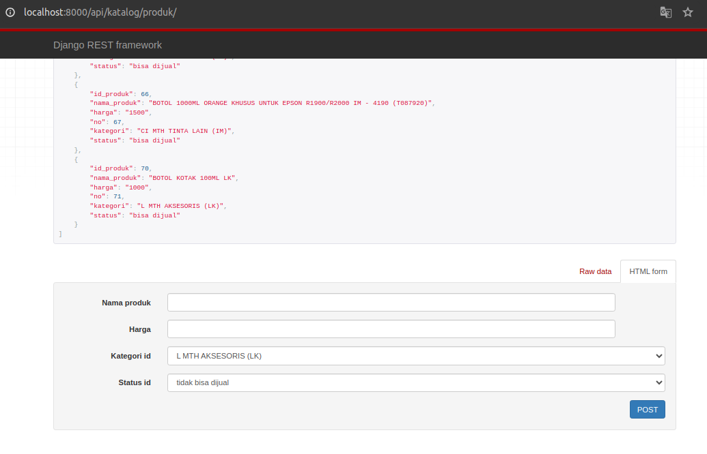

# Tes Programming Backend

Repositori ini ditujukan untuk proses rekrutmen untuk posisi _backend developer_. _Tech stack_ yang digunakan untuk repo ini adalah **Django** dan **Docker**.

## Prerequisites

Berikut paket-paket yang dibutuhkan dalam pembuatan API:

1. Python `--` 3.10
2. virtualenv `--` 20.13
3. Docker `--` 24.0
4. Docker Compose `--` 1.29
5. pip `--` 22.0

- sedangkan editor yang digunakan adalah VSCode.

> Sebelum melakukan pengetesan pastikan paket-paket yang dibutuhkan telah terinstall.

---

## Testing

Selanjutnya silahkan kloning repo ini ke dalam sebuah folder.

1.  buat folder untuk menampung repo.

```sh
mkdir tes_fastprint
cd tes_fastprint
```

> penulis menggunakan sistem operasi Linux, untuk sistem operasi lain, silahkan menyesuaikan

2.  kloning repo dari github.com

```sh
git clone https://github.com/masprast/fastprint
```

---

### Konfigurasi _environtment_

Selanjutnya adalah melakukan konfigurasi _environtment_ agar repositori tetap terisolasi, menghindari _conflict_ dengan paket-paket yang yang sama dan telah terinstall pada komputer.

1.  Menyiapkan _environtment_

```sh
python3 -m venv env
```

2.  Mengaktifkan _environtment_

```sh
. /env/bin/activate
```

3. Menginstall paket-paket yang dibutuhkan

```sh
pip3 install -r requirements.txt
```

---

### Konfigurasi PostgreSQL DB

Langkah selanjutnya adalah konfigurasi database, yakni PostgreSQL dalam bentuk container.

1.  Buka terminal dalam VSCode dengan kombinasi `Ctrl + J`

> #### Menyimpan data dari API ke DB
>
> Ambil data dari tautan API tes programmer dengan cara sebagai berikut:
>
> 1. Jalankan aplikasi REST API testing (contoh: Postman)
> 2. Masukkan alamat tautan API tes programer
> 3. Set _method_ ke **POST**
> 4. Lalu jalankan skrip python untuk membuat _password_ yang dienkripsi dengan **md5**, salin ke bagian form pada aplikasi Postman
>
> ```sh
> python3 utils/password_hasher.py
> ```
>
> 5. Simpan respon dari server API dengan nama file **`restapi.json`** ke dalam folder proyek ini.
>
> - Jika tidak ingin mengambil data baru, lewati langkah ini. Penulis sudah mengunduh data dari server tes API
>
>   <br/>

<br/>

2.  Jalankan docker-compose, dan tunggu hingga selesai dan tertera "`LOG:  database system is ready to accept connections`" pada terminal

```sh
docker-compose up --build &
```

3.  Lalu jalankan perintah

```sh
python3 manage.py migrate
```

---

### Menjalankan Django

Lalu menjalankan Django dengan perintah berikut:

```sh
python3 manage.py runserver
```

Selanjutnya jalankan web browser lalu buka alamat `localhost:8000/api/katalog/produk`

---

### Testing API CRUD

Langkah terakhir adalah melakukan testing API CRUD.

1. Menampilkan daftar produk dengan menjalankan web browser lalu buka alamat `localhost:8000/api/katalog/produk`

   <center>Tampilan daftar produk</center>
<br/>

2. Melihat detil produk
Dengan menambahkan `id_produk` pada alamat API, contoh: `localhost:8000/api/katalog/produk/6`

   <center>Tampilan detil produk</center>
<br/>

3. Menambah produk dalam daftar
_Scroll_ hingga batas bawah dan menemukan _box_ untuk memasukkan data produk baru

   <center>Tampilan box tambah produk</center>
<br/>

4. Mengubah dan menghapus produk
   Untuk mengubah dan menghapus data produk dapat dilakukan pada halaman detil produk
   
   <center>Tampilan detil produk</center>
